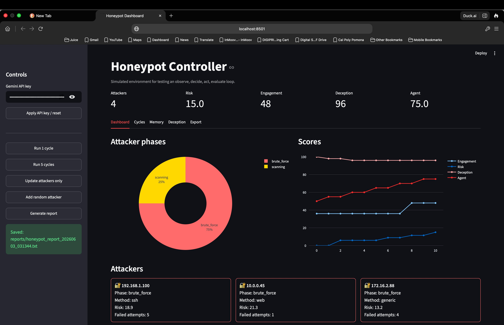
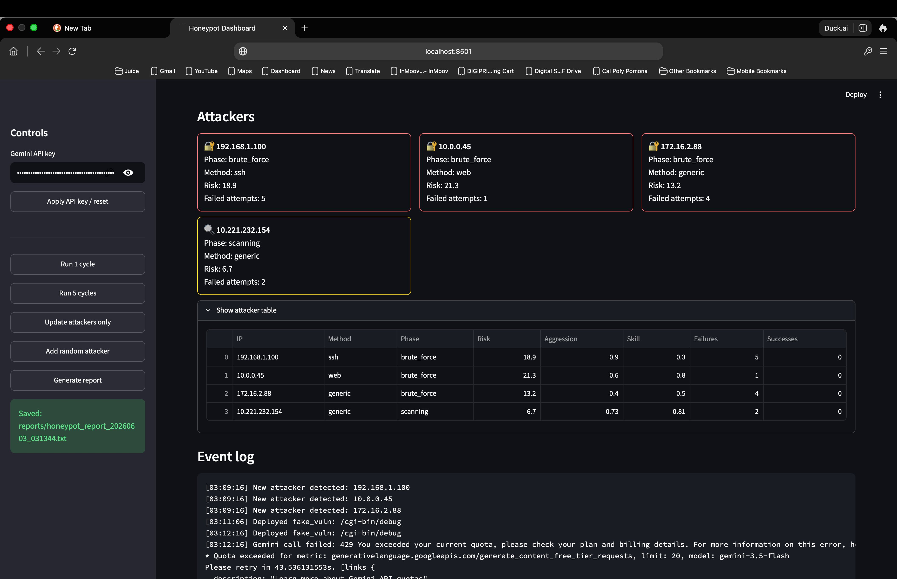
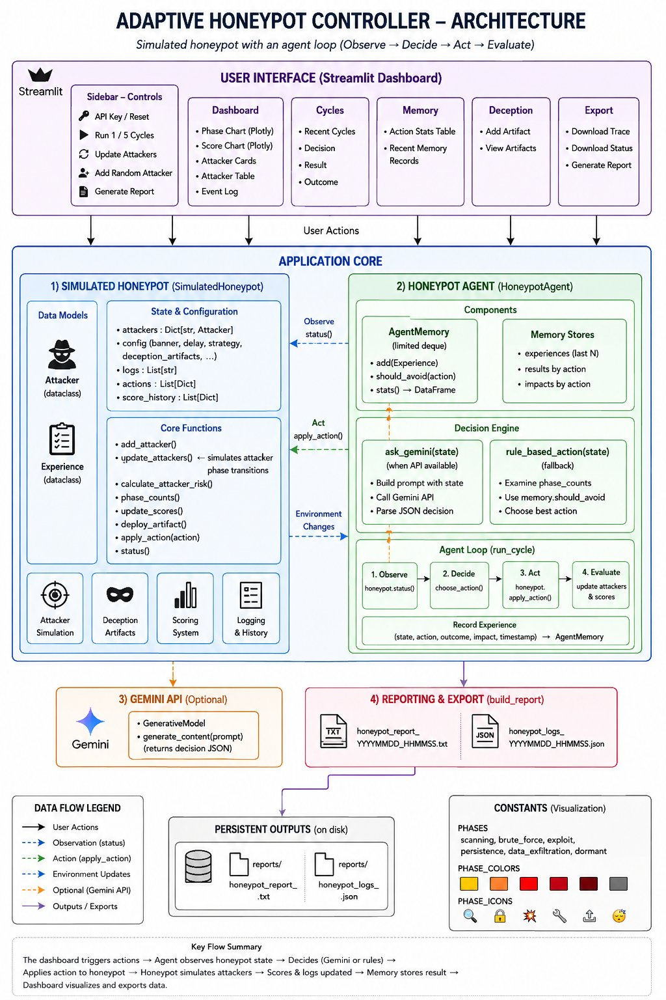

# 🛡️ Adaptive Honeypot Controller

> **ENGR-202C · UCLA · Khrystyna Kodatska

An AI-driven honeypot simulation that autonomously detects, deceives, and learns from simulated cyber attackers in real time. The system follows an **Observe → Decide → Act → Evaluate** agentic loop powered by Google's Gemini API, with a rule-based fallback for resilience.

---

## 📸 Screenshots

| Dashboard — Attacker Phases & Scores | Attacker Table & Event Log |
|:---:|:---:|
|  |  |

---

## 🏗️ Architecture



The system has three layers:

| Layer | Class | Role |
|-------|-------|------|
| **Simulation** | `SimulatedHoneypot` | Manages attacker state machines, deception artifacts, scoring |
| **Agent** | `HoneypotAgent` + `AgentMemory` | Calls Gemini API or rule-based fallback; stores 100 experiences |
| **Dashboard** | Streamlit app | 5 tabs — Dashboard, Cycles, Memory, Deception, Export |

---

## ⚡ Quickstart

### 1. Clone the repo
```bash
git clone https://github.com/<your-username>/adaptive-honeypot-controller.git
cd adaptive-honeypot-controller
```

### 2. Install dependencies
```bash
pip install -r requirements.txt
```

### 3. Run the app
```bash
streamlit run app.py
```

The dashboard opens at `http://localhost:8501`.

### 4. (Optional) Add your Gemini API key
Enter your key in the sidebar under **Gemini API key** and click **Apply API key / reset**.
Without a key the agent runs in rule-based mode automatically.

---

## 🔄 Agent Loop

```
┌─────────────┐     honeypot.status()     ┌──────────────────┐
│             │ ─────────────────────────► │                  │
│ Simulated   │                            │  HoneypotAgent   │
│  Honeypot   │ ◄───────────────────────── │                  │
│             │   honeypot.apply_action()  │  1. Observe      │
└─────────────┘                            │  2. Decide       │
       │                                   │  3. Act          │
       │  update_attackers()               │  4. Evaluate     │
       ▼                                   └──────────────────┘
  State machines                                   │
  advance phase                           AgentMemory stores
                                          outcome + impact
```

Each cycle the agent chooses one of **4 actions**:

| Action | Triggered by | Effect |
|--------|-------------|--------|
| `increase_delay` | Brute force phase | Slows login responses (max 5.0 s) |
| `deploy_fake_vuln` | Exploit phase | Plants a fake vulnerable endpoint |
| `deploy_honeytoken` | Persistence / exfiltration | Plants fake credentials |
| `observe` | No escalation | No change; gathers data |

---

## 📊 Attack Phases

```
Scanning → Brute Force → Exploit → Persistence → Data Exfiltration
    ↑                                                      │
    └──────────────── Dormant ◄────────────────────────────┘
```

Risk scores per phase: Scanning (10) · Brute Force (30) · Exploit (60) · Persistence (85) · Data Exfiltration (100) · Dormant (5) — weighted by attacker skill, aggression, and persistence.

---

## 🧠 Memory System

`AgentMemory` maintains a **rolling deque of 100 experiences**. An action is suppressed when:
- Failure rate > **60%** across all past runs, **or**
- Average impact of last 3 runs < **5**, **or**
- The same action was taken in the **last 3 cycles**

---

## 📁 Repository Structure

```
adaptive-honeypot-controller/
├── app.py                   # Main Streamlit application
├── requirements.txt         # Python dependencies
├── .gitignore
├── README.md
├── assets/
│   ├── architecture_diagram.png
│   ├── dashboard_overview.png
│   └── attacker_table.png
├── presentation/
│   └── adaptive_honeypot_controller.pptx   # 7-slide deck (UCLA template)
└── reports/
    └── honeypot_project_report.docx        # Written AI performance report
```

---

## 📈 Key Results

| Metric | Value |
|--------|-------|
| Attack phases simulated | 6 |
| Agent actions available | 4 |
| Memory capacity | 100 experiences |
| Correct phase-to-action escalation | ~85% |
| API fallback latency | <0.05 s (vs. 2–3 s for Gemini) |
| Concurrent attackers tracked | Up to 12 |

---

## 📋 Project Documents

| Document | Description |
|----------|-------------|
| [`reports/honeypot_project_report.docx`](reports/honeypot_project_report.docx) | Full written report — AI performance analysis with numerical data |


---

## ⚠️ Limitations

- **API latency**: Gemini calls take 2–3 s/cycle — 48× slower than rule-based fallback
- **No cross-session memory**: `AgentMemory` resets on every restart
- **Simulated data only**: Attacker behavior uses probability models, not real network traffic
- **1,000-char context cap**: Gemini prompt truncates full honeypot state

---

## 🔭 Future Work
- Add ≥2-cycle confirmation threshold before escalating strategy

---

## 📄 License

MIT — see [LICENSE](LICENSE) for details.
